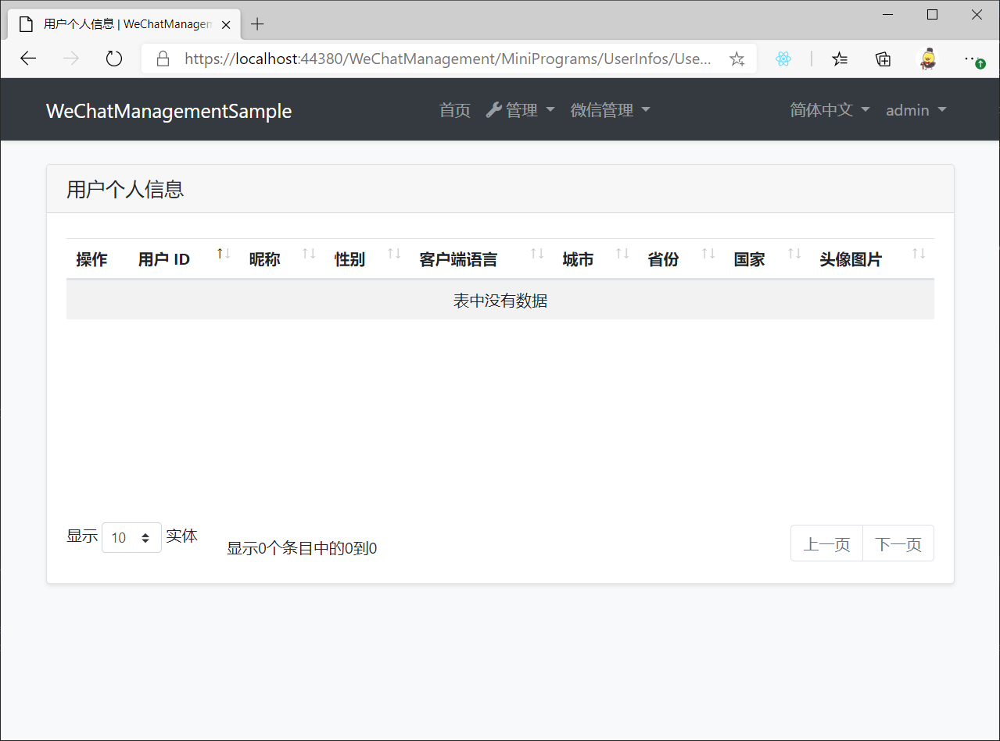

# WeChatManagement

基于EasyAbp.Abp.WeChat模块实现微信登录、微信用户信息存储、微信服务器管理、微信第三方平台等高级功能的Abp应用模块组

## Getting Started

* Install with [AbpHelper](https://github.com/EasyAbp/AbpHelper.GUI)

    Coming soon.

* Install Manually

    * [安装小程序模块](docs/MiniPrograms/README.md#getting-started)
    * 安装公众号模块
    * 安装企业微信模块
    * 安装第三方平台模块

## Usage

* [使用小程序模块](docs/MiniPrograms/README.md#usage)
* 使用公众号模块
* 使用企业微信模块
* 使用第三方平台模块

## Roadmap

- [ ] 公众号模块
- [ ] 企业微信模块
- [ ] 第三方平台模块
