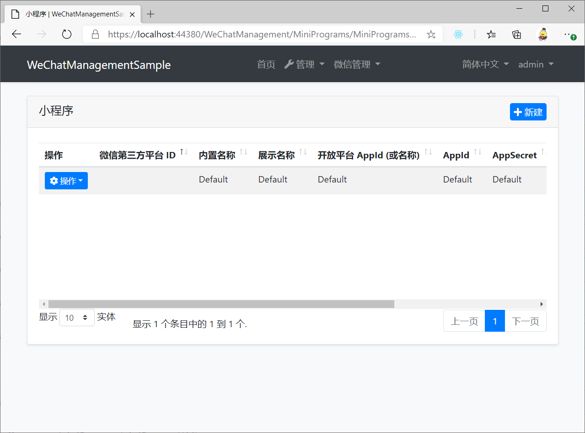
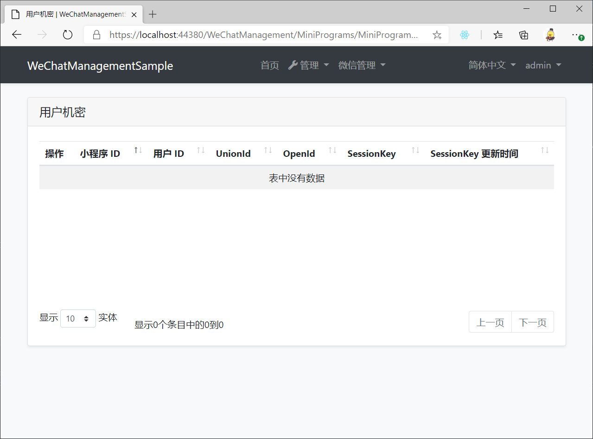
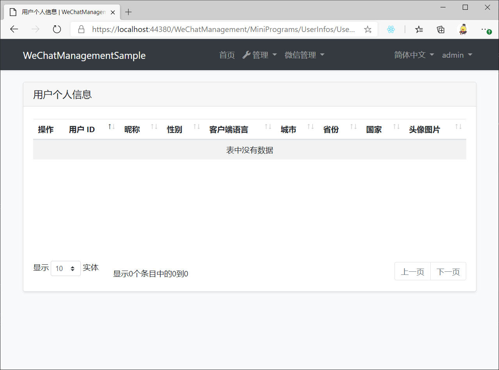
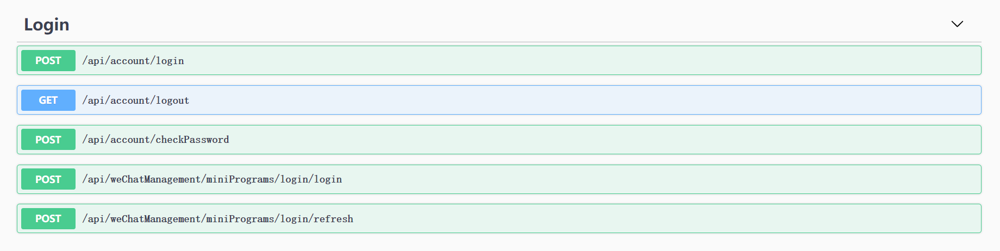

# WeChatManagement.MiniPrograms

Abp 小程序管理模块，提供小程序登录、用户个人信息记录、小程序微信服务器等功能，自动适应微信开放平台规则，与微信第三方平台模块轻松衔接。

## Getting Started

* Install with [AbpHelper](https://github.com/EasyAbp/AbpHelper.GUI)

    Coming soon.

* Install Manually

    1. Install `EasyAbp.WeChatManagement.MiniPrograms.Application` NuGet package to `MyProject.Application` project and add `[DependsOn(WeChatManagementMiniProgramsApplicationModule)]` attribute to the module.

    1. Install `EasyAbp.WeChatManagement.MiniPrograms.Application.Contracts` NuGet package to `MyProject.Application.Contracts` project and add `[DependsOn(WeChatManagementMiniProgramsApplicationContractsModule)]` attribute to the module.

    1. Install `EasyAbp.WeChatManagement.MiniPrograms.Domain` NuGet package to `MyProject.Domain` project and add `[DependsOn(WeChatManagementMiniProgramsDomainModule)]` attribute to the module.

    1. Install `EasyAbp.WeChatManagement.MiniPrograms.Domain.Shared` NuGet package to `MyProject.Domain.Shared` project and add `[DependsOn(WeChatManagementMiniProgramsDomainSharedModule)]` attribute to the module.

    1. Install `EasyAbp.WeChatManagement.MiniPrograms.EntityFrameworkCore` NuGet package to `MyProject.EntityFrameworkCore` project and add `[DependsOn(WeChatManagementMiniProgramsEntityFrameworkCoreModule)]` attribute to the module.

    1. Install `EasyAbp.WeChatManagement.MiniPrograms.HttpApi` NuGet package to `MyProject.HttpApi` project and add `[DependsOn(WeChatManagementMiniProgramsHttpApiModule)]` attribute to the module.

    1. Install `EasyAbp.WeChatManagement.MiniPrograms.HttpApi.Client` NuGet package to `MyProject.HttpApi.Client` project and add `[DependsOn(WeChatManagementMiniProgramsHttpApiClientModule)]` attribute to the module.

    1. Install `EasyAbp.WeChatManagement.MiniPrograms.MongoDB` NuGet package to `MyProject.MongoDB` project and add `[DependsOn(WeChatManagementMiniProgramsMongoDbModule)]` attribute to the module.

    1. (Optional) If you need MVC UI, install `EasyAbp.WeChatManagement.MiniPrograms.Web` NuGet package to `MyProject.Web` project and add `[DependsOn(WeChatManagementMiniProgramsWebModule)]` attribute to the module.
    
    1. Add `builder.ConfigureWeChatManagementMiniPrograms();` to OnModelCreating method in `MyProjectMigrationsDbContext.cs`.

    1. Add EF Core migrations and update your database. See: [ABP document](https://docs.abp.io/en/abp/latest/Tutorials/Part-1?UI=MVC#add-new-migration-update-the-database).
    
    1. 在 Web / HttpApi.Host 启动项目的 appsettings.json 的 AuthServer 中增加 `ClientId` 和 `ClientSecret` 配置（可使用文件中 IdentityServer 中的配置）。
    
    1. 在 IdentityServerClientGrantTypes 表中给上一步使用的 Client 增加一条 `WeChatMiniProgram_credentials` 的 GrantType.

## Usage

### 微信登录

* 使用 `/api/weChatManagement/miniPrograms/login/login` 接口进行微信登录，留意 [LoginDto](../../modules/MiniPrograms/src/EasyAbp.WeChatManagement.MiniPrograms.Application.Contracts/EasyAbp/WeChatManagement/MiniPrograms/Dtos/LoginDto.cs) 的注释说明。
    
* 使用 `/api/weChatManagement/miniPrograms/login/refresh` 接口对 AccessToken 续期。

## Roadmap

- [ ] 微信服务器
- [ ] 对接第三方平台模块
- [ ] Unit tests.
